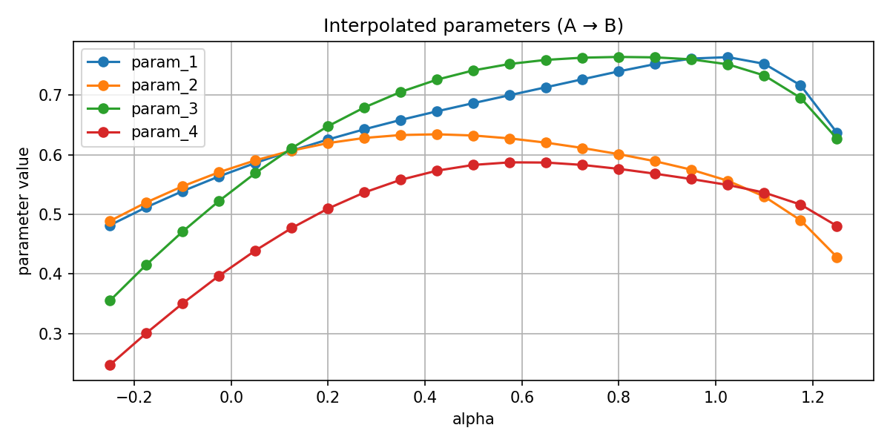

# 🎧 AWOL for Audio — Language-to-Sound Generation via Parametric Synthesis


**Author**: Mariagiusi Nicodemo  
**Email**: nicodemo.2114171@studenti.uniroma1.it  
**Course**: Machine Learning (a.y. 2024/2025) — Sapienza University of Rome

This project explores the mapping between **natural language descriptions** and **interpretable FM-synthesis controls**, inspired by the **AWOL paradigm**.  
The pipeline evolves from a **baseline MLP** to a **regularized MLP**, then to a **conditional RealNVP flow**, and finally includes **latent space exploration** via interpolation and extrapolation of CLAP text embeddings.  


---

## 🎯 Objective

The objective of this project is to establish a direct mapping from natural language descriptions to **interpretable FM-synthesis parameters**, inspired by the AWOL paradigm.  
The goal is to replace black-box audio generation with a **transparent and controllable pipeline**, enabling smooth and coherent sound generation from text.

---

## 📁 Repository Structure

All notebooks are in the `notebook/` folder and runnable on Google Colab.

| Notebook                                  | Description                                                                | Open in Colab |
|------------------------------------------|----------------------------------------------------------------------------|----------------|
| `01_BaselineClapToFmMlp.ipynb` | Baseline pipeline CLAP → MLP → FM synth (no training).                    | [▶️ Open](https://colab.research.google.com/github/Mariagiusi23/ID-001-AWOL-for-Audio/blob/main/notebook/01_Baseline_CLAP_to_FM_MLP.ipynb) |
| `02_AWOL_EnhancedMlp.ipynb`        | Supervised training of the MLP model on a manual dataset.                 | [▶️ Open](https://colab.research.google.com/github/Mariagiusi23/ID-001-AWOL-for-Audio/blob/main/notebook/02_Enhanced_MLP.ipynb) |
| `03_ConditionRealNvp.ipynb`           | RealNVP implementation for semantic → audio parameter mapping.           | [▶️ Open](https://colab.research.google.com/github/Mariagiusi23/ID-001-AWOL-for-Audio/blob/main/notebook/03_Conditional_RealNVP_with_Learnable_Masks.ipynb) |
| `04_AWOL_LatentSpaceExploration.ipynb`   | Latent space interpolation, baseline comparison, Gradio demo.            | [▶️ Open](https://colab.research.google.com/github/Mariagiusi23/ID-001-AWOL-for-Audio/blob/main/notebook/04_Latent_Space_Exploration_with_Conditional_Flow.ipynb) |

Each `outputs_nbXX` folder is located inside the `assets/` directory and contains the results produced by the corresponding notebook, including audio samples (`.wav`), plots, and model checkpoints (`.pt`).


---

## ⚙️ Setup

You can run the project in a new environment or in Google Colab.

### ⚙️ Setup & Reproducibility

To reproduce the full pipeline and results of this project, follow these steps:

1. **Clone the repository**
   ```bash
   git clone https://github.com/Mariagiusi23/ID-001-AWOL-for-Audio.git
   cd ID-001-AWOL-for-Audio

2. If you are running on Google Colab: all required libraries are installed automatically through the setup cells provided in each notebook.
If you are NOT on Colab (e.g., local machine or custom environment): you must install the dependencies manually:
pip install -r requirements.txt

3. Run the notebooks sequentially: the workflow is designed to be executed in order, since each notebook produces outputs that may be used by the next ones

4. All generated results (audio .wav, plots, and model checkpoints .pt) are saved inside the assets/ directory, organized per notebook (outputs_nb01, outputs_nb02, …).
The final report summarizing methods and results is available at: [Nicodemo_Mariagiusi_AWOL_Project.pdf (open)](https://github.com/Mariagiusi23/ID-001-AWOL-for-Audio/blob/main/report/Nicodemo_Mariagiusi_AWOL_Project.pdf)
---

## 📊 Results

The evaluation combined **numerical accuracy** on FM-synthesis parameters and **semantic coherence** measured through CLAP similarity.  
Additional qualitative evaluation was carried out on **unseen prompts** and **latent-space interpolations**.

### Parameter prediction (RMSE on test set)
| Parameter         | RMSE  |
|-------------------|-------|
| Amplitude         | 0.068 |
| Carrier Frequency | 0.114 |
| Ratio             | 0.180 |
| Modulation Index  | 0.098 |

Amplitude, carrier frequency, and modulation index were predicted with low errors (<0.12), while the frequency ratio proved more difficult (≈0.18), reflecting its key role in FM timbre.

### CLAP similarity across models and temperatures
| Mode   | τ       | CLAP sim |
|--------|---------|----------|
| mlp    | 0.2–1.0 | ~0.089   |
| zero   | 0.2–1.0 | ~0.080   |
| sample | 0.6     | 0.164    |
| sample | 1.5     | 0.081    |

The conditional RealNVP flow achieved the highest semantic alignment at **τ ≈ 0.6**, while extreme sampling temperatures reduced performance.

### Qualitative results
- On **unseen prompts**, the model produced coherent and plausible FM controls without collapsing.  
- **Latent-space interpolation** generated smooth sound transitions between prompts.  
- **Extrapolation** (α < 0 or α > 1) generally preserved semantic coherence, though with occasional instability.

---

## 🎧 Demo

A simple **Gradio interface** is provided in **Notebook 04** (`04_Latent_Space_Exploration_with_Conditional_Flow.ipynb`).  
It allows interactive text-to-sound generation:

- **Input**: a natural language prompt  
- **Mode selection**: `mlp`, `zero`, or `sample`  
- **Temperature (τ)**: controls the stochasticity of the generated parameters  

When running in **Google Colab**, the demo launches directly inside the notebook output.  
Locally, Gradio will open a web interface at `http://127.0.0.1:7860`.

### Example from Notebook 04
Below is an example of **interpolated parameters (A → B)** obtained during latent space exploration:



---
---

## 📚 References

- Zuffi, S., & Black, M. J. (2024).  
  *AWOL: Analysis Without Synthesis Using Language*.  
  [arXiv:2404.03042](https://arxiv.org/abs/2404.03042)

- Elizalde, B., Deshmukh, S., Ismail, M. A., & Wang, H. (2022).  
  *CLAP: Learning Audio Concepts from Natural Language Supervision*.  
  [arXiv:2206.04769](https://arxiv.org/abs/2206.04769)

- Wu, Y., Chen, K., Zhang, T., Hui, Y., Nezhurina, M., Berg-Kirkpatrick, T., & Dubnov, S. (2022).  
  *Large-scale Contrastive Language-Audio Pretraining with Feature Fusion and Keyword-to-Caption Augmentation*.  
  [arXiv:2204.03409](https://arxiv.org/abs/2204.03409)

- Guzhov, A., Raue, F., Hees, J., & Dengel, A. (2021).  
  *AudioCLIP: Extending CLIP to Image, Text and Audio*.  
  [arXiv:2106.13043](https://arxiv.org/abs/2106.13043)

- Radford, A., Kim, J. W., Hallacy, C., Ramesh, A., Goh, G., Agarwal, S., Sastry, G., Askell, A., Mishkin, P., Clark, J., Krueger, G., & Sutskever, I. (2021).  
  *Learning Transferable Visual Models from Natural Language Supervision*.  
  [arXiv:2103.00020](https://arxiv.org/abs/2103.00020)

- Dinh, L., Sohl-Dickstein, J., & Bengio, S. (2017).  
  *Density Estimation Using Real NVP*.  
  [arXiv:1605.08803](https://arxiv.org/abs/1605.08803)

- Kingma, D. P., & Welling, M. (2014).  
  *Auto-Encoding Variational Bayes*.  
  [arXiv:1312.6114](https://arxiv.org/abs/1312.6114)

- Kingma, D. P., & Dhariwal, P. (2018).  
  *Glow: Generative Flow with Invertible 1x1 Convolutions*.  
  [arXiv:1807.03039](https://arxiv.org/abs/1807.03039)

- Engel, J., Hantrakul, L., Gu, C., & Roberts, A. (2020).  
  *DDSP: Differentiable Digital Signal Processing*.  
  [ICLR 2020](https://magenta.tensorflow.org/ddsp)

- Copet, J., Défossez, A., Synnaeve, G., & Adi, Y. (2023).  
  *Simple and Controllable Music Generation (MusicGen)*.  
  [arXiv:2306.05284](https://arxiv.org/abs/2306.05284)


