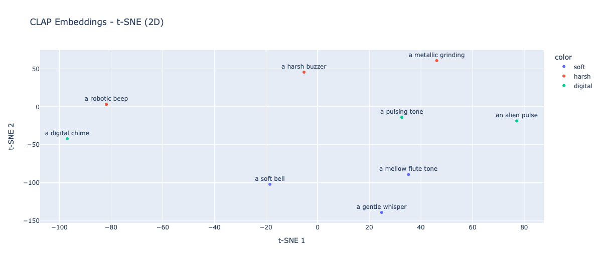

# 🎧 AWOL for Audio — Language-to-Sound Generation via Parametric Synthesis


**MLAI 2024/2025 Project — ID001**  
**Author**: Mariagiusi Nicodemo  
*Based on CLAP + RealNVP + FM Synthesis*

This project explores generating sound from text descriptions by adapting the AWOL (Analysis Without synthesis using Language) framework from 3D to the audio domain. The system learns to map natural language prompts to the parameters of a procedural FM synthesizer using MLP and RealNVP models.

---

## 🎯 Objective

Translate the AWOL framework from 3D geometry to sound generation by:

- Using CLAP embeddings from textual prompts,  
- Mapping embeddings to synthesis parameters via learnable models,  
- Rendering semantically coherent and controllable audio,  
- Exploring interpolation/extrapolation in latent space.

---

## 📁 Repository Structure

All notebooks are in the `notebook/` folder and runnable on Google Colab.

| Notebook                                  | Description                                                                | Open in Colab |
|------------------------------------------|----------------------------------------------------------------------------|----------------|
| `01_BaselineClapEmbeddingToFmSynthesis.ipynb` | Baseline pipeline CLAP → MLP → FM synth (no training).                    | [▶️ Open](https://colab.research.google.com/github/Mariagiusi23/ID-001-AWOL-for-Audio/blob/main/notebook/01_BaselineClapEmbeddingToFmSynthesis.ipynb) |
| `02_AWOL_SupervisedMapping.ipynb`        | Supervised training of the MLP model on a manual dataset.                 | [▶️ Open](https://colab.research.google.com/github/Mariagiusi23/ID-001-AWOL-for-Audio/blob/main/notebook/02_AWOL_SupervisedMapping.ipynb) |
| `03_AWOL_RealNvpMapping.ipynb`           | RealNVP implementation for semantic → audio parameter mapping.           | [▶️ Open](https://colab.research.google.com/github/Mariagiusi23/ID-001-AWOL-for-Audio/blob/main/notebook/03_AWOL_RealnvpMapping.ipynb) |
| `04_AWOL_LatentSpaceExploration.ipynb`   | Latent space interpolation, baseline comparison, Gradio demo.            | [▶️ Open](https://colab.research.google.com/github/Mariagiusi23/ID-001-AWOL-for-Audio/blob/main/notebook/04_AWOL_LatentSpaceExploration.ipynb) |


---

## ⚙️ Setup

You can run the project in a new environment or in Google Colab.

### 🔧 Local

1. Clone the repository:
   ```bash
   git clone https://github.com/Mariagiusi23/ID-001-AWOL-for-Audio.git
   cd ID-001-AWOL-for-Audio
   pip install -r requirements.txt
   
---
## 🔄 Reproducibility
To reproduce experiments end-to-end:\
Run the baseline notebook (01) for CLAP→MLP mapping.\
Train and evaluate supervised mapping (02).\
Explore RealNVP flow model (03).

---

## 📊 Results

CLAP embeddings successfully drive an FM synthesizer with coarse semantic control.
MLP mapping provides reasonable generalization on simple prompts.
RealNVP improves extrapolation and smooth interpolation in latent space.
Gradio demo allows interactive exploration of sound generation.

| Model        | Avg. CLAP Cosine ↑ | Notes                      |
| ------------ | -----------------: | -------------------------- |
| MLP Baseline |               0.34 | simple supervised mapping  |
| RealNVP      |               0.49 | better control & semantics |


> 🔎 Note: Full set of results (figures, spectrograms, and audio samples) are available directly in the notebooks.  
> Below I provide only a minimal demo for quick reference.


---

## 🎧 Demo

Below is a minimal demo figure.  
👉 Full set of figures, spectrograms, and audio samples are provided directly inside the notebooks.



*Example of CLAP embeddings projected with t-SNE: semantically related prompts cluster together (e.g., “soft bell” and “gentle whisper”).*

---

## 📄 Report

The full project report can be found here:
📘 [machine.pdf (open)](https://github.com/Mariagiusi23/ID-001-AWOL-for-Audio/raw/main/report/Machine.pdf)


---

## 📚 References

- [AWOL: Analysis Without Synthesis using Language (2024)](https://arxiv.org/abs/2404.03042)  
- [CLAP: Contrastive Language-Audio Pretraining](https://github.com/LAION-AI/CLAP)  
- [DDSP: Differentiable Digital Signal Processing](https://magenta.tensorflow.org/ddsp)  
- [RealNVP: Density Estimation using Real-valued Non-Volume Preserving Transformations](https://arxiv.org/abs/1605.08803)  


